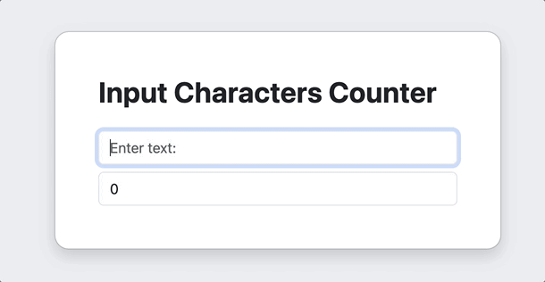

<a name="readme-top"></a>


<div align="center">
<!-- Title: -->
<h1><a href="https://github.com/skthati/Javascript.git">Javascript</a> - Basics </h1>
</div>

<!-- Table of contents -->
<hr>
<hr>
<ol>
    <li><a href="#js-basics">JS Basics</a></li>
    <li><a href="#length-of-sentence">Length of Sentence</a></li>
    <li><a href="#count-characters-while-typing">Count no of Characters while type</a></li>

</ol>
<hr>
<hr>


# Javascript Basics <a name="js-basics"></a>
 All basic code syntax 

```Javascript
//Javascript
console.log("Hello World!")
```
```Python
#Python
print("Hellow World!")
```
##### Alert
```Javascript
alert("Hello from pop up window!")
```

##### Prompt
```Javascript
var message = prompt("Enter your name: ")
```
### Length of sentence
###### Console
```Javascript
var message = prompt("Enter your name: ")
console.log(message.length)

----
7
----
```
###### HTML
index.html
```html
<!DOCTYPE html>
<html lang="en">
    <head>
        <meta charset="UTF-8">
        <link rel="stylesheet" href="src/style.css">
    </head>
    <body>
        <h1 id="header"></h1>
        <script src="src/script.js"></script>
    </body>
</html>
```
style.css
```css
body {
    background: transparent;
    color: while;
    padding: 1px;
    margin: 0px;
}
```
script.js
```javascript
var message = "Hello World!"

var mySentence = prompt("Enter the sentence: ")
var maxSentence = 50
message = `Character count is: ${mySentence.length}. You have {maxSentence - mySentence.length} characters left!`

document.querySelector('#header`).innerHTML = message
```

<p align="right">(<a href="#readme-top">back to top</a>)</p>
<hr>  

## Character Count - Javascript - html <a name="count-characters-while-typing"></a>
Count no of characters typed.




```html, javascript
<!DOCTYPE html>
<html  lang="en">
	<head>
    	<meta charset="UTF-8">
        <title> Count Characters </title>
        <script>
        	function countCharacters() {
            	var message = document.getElementById('inputText').value;
                var messageCount = message.length;
                document.getElementById('characterCount').innerText = "Character Count: " + messageCount;
           	}
        </script>
            
    </head>
    <body>
    	<label for="inputText">Enter your text: </label>
        <input type="text" id="inputText" oninput="countCharacters()">
        <div id="characterCount">Character Count: </div>
    </body>
</html>
    	
```
<p align="right">(<a href="#readme-top">back to top</a>)</p>
<hr>  


