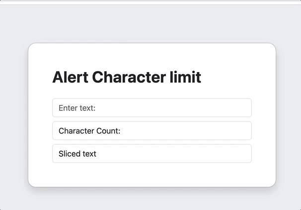
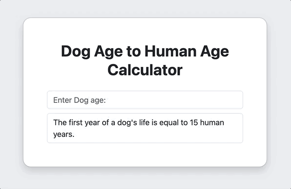
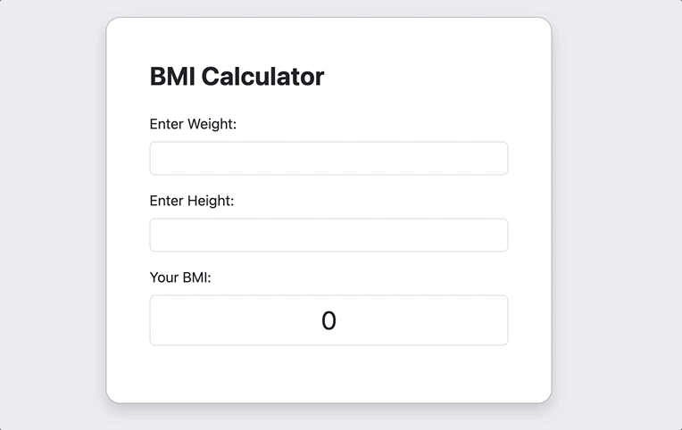
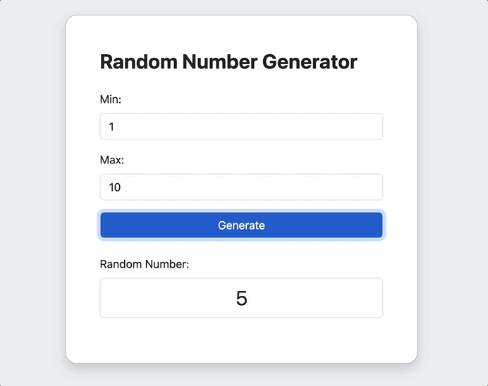

<a name="readme-top"></a>


<div align="center">
<!-- Title: -->
<h1><a href="https://github.com/skthati/Javascript.git">Javascript</a> - Basics </h1>
</div>

<!-- Table of contents -->
<hr>
<hr>
<ol>
    <li><a href="#js-basics">JS Basics</a></li>
    <li><a href="#length-of-sentence">Length of Sentence</a></li>
    <li><a href="#count-characters-while-typing">Count no of Characters while type</a></li>
    <li><a href="d_age-to-h_age-calc">Dog age to Human age Calculator</a></li>
    <li><a href="bmi-calculator">BMI Calculator</a></li>
    <li><a href="random-number-generator">Generate Random Number</a></li>

</ol>
<hr>
<hr>


# Javascript Basics <a name="js-basics"></a>
 All basic code syntax 

```Javascript
//Javascript
console.log("Hello World!")
```
```Python
#Python
print("Hellow World!")
```
### Alert
```Javascript
alert("Hello from pop up window!")
```

### Prompt
```Javascript
var message = prompt("Enter your name: ")

### Slice
```Javascript
alert(prompt("slice code: ").slice(0, 10))
```

### To lower case
```Javascript
message = message.toLowerCase();
```

### To Upper Case
```javascript
message = message.toUpperCase();
```
### To Title Case
```javascript
var message = 'hello'
m1 = message.slice(0, 1)
console.log(m1)
m2 = message.slice(1, message.length)
console.log(m2)
title_message = m1.toUpperCase() + m2
console.log(title_message)
```


## Length of sentence
### Console
```Javascript
var message = prompt("Enter your name: ")
console.log(message.length)

----
7
----
```
### HTML
index.html
```html
<!DOCTYPE html>
<html lang="en">
    <head>
        <meta charset="UTF-8">
        <link rel="stylesheet" href="src/style.css">
    </head>
    <body>
        <h1 id="header"></h1>
        <script src="src/script.js"></script>
    </body>
</html>
```
style.css
```css
body {
    background: transparent;
    color: while;
    padding: 1px;
    margin: 0px;
}
```
script.js
```javascript
var message = "Hello World!"

var mySentence = prompt("Enter the sentence: ")
var maxSentence = 50
message = `Character count is: ${mySentence.length}. You have {maxSentence - mySentence.length} characters left!`

document.querySelector('#header`).innerHTML = message
```

<p align="right">(<a href="#readme-top">back to top</a>)</p>
<hr>  

## Character Count - Javascript - html <a name="count-characters-while-typing"></a>
Count no of characters typed.


</hr>



```html, javascript
<!DOCTYPE html>
<!DOCTYPE html>
<html  lang="en">
	<head>
    	<meta charset="UTF-8">
        <title> Count Characters </title>
        <script>
        	function countCharacters() {
            	var message = document.getElementById('inputText').value;
                var messageCount = message.length;
                var maxCount = 20
                if (messageCount > 20) {
                	alert("Only 20 Characters are allowed!")
                }
                
                document.getElementById('characterCount').innerText = "Character Count: " + messageCount + "/" + maxCount ;
                document.getElementById('slicedMessage').innerText = message;
           	}
            
        </script>
            
    </head>
    <body>
    	<label for="inputText">Enter your text: </label>
        <input type="text" id="inputText" oninput="countCharacters()">
        <div id="characterCount">Character Count: </div>
        <div id="slicedMessage"></div>
    </body>
</html>
    	
```
<p align="right">(<a href="#readme-top">back to top</a>)</p>
<hr>  

## Dog Age to Human Age Calculator <a name="d_age-to-h_age-calc"></a>

Formula = `human-age = (dog-age - 2) * 4 + 21



```Javascript

function human_age(d_age) {
    human_age = ((d_age - 2) * 4) + 21
    return human_age
}

var d_age = prompt("Enter dog age: ")
console.log(human_age(d_age))

---------
Output

53

```
<p align="right">(<a href="#readme-top">back to top</a>)</p>
<hr>  

## BMI Calculator <a name="bmi-calculator">




<p align="right">(<a href="#readme-top">back to top</a>)</p>
<hr>  

## Random Number Generator <a name="random-number-generator"></a>

Generate random number using minimum and maximum values inclusive. JS `Math.random`.



<p align="right">(<a href="#readme-top">back to top</a>)</p>
<hr>  
